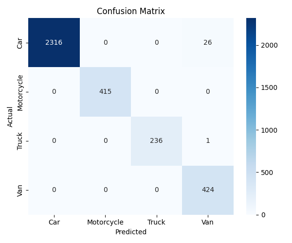
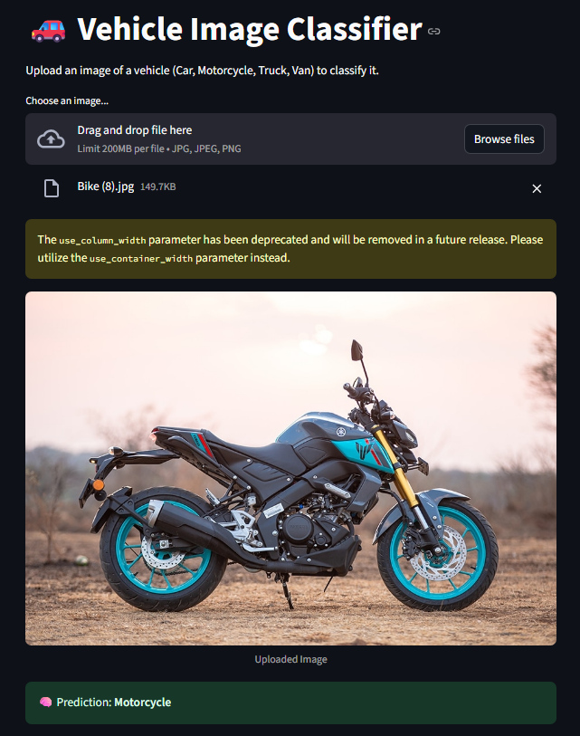

# 🚗 Vehicle Image Classifier using Deep Learning

Welcome to the **Vehicle Image Classifier**, a deep learning project built to identify types of vehicles (Car, Motorcycle, Truck, Van) using a convolutional neural network (ResNet18) trained on real-world images. The model is deployed via an interactive **Streamlit** web app for ease of testing and exploration.

---

## 📌 Overview

With the rise of intelligent transportation systems, automotive analytics, and smart surveillance, quick and reliable vehicle classification is crucial. This project uses **transfer learning** with **ResNet18**, achieving over **99% accuracy** on a custom dataset.

You can upload your own image of a vehicle, and the app will classify it instantly!

---

## 🚀 Features

- 🔍 Classifies images into 4 categories: **Car**, **Motorcycle**, **Truck**, **Van**
- 💻 Built with **PyTorch** and **Torchvision**
- 🧠 Fine-tuned using **transfer learning (ResNet18)**
- 🌐 Deployed via **Streamlit** for quick visual inference
- 🖼️ Handles image preprocessing automatically
- 📊 Includes evaluation metrics, confusion matrix, and training results

---

## 🖼️ Sample Predictions

| Input Image | Prediction |
|-------------|------------|
|  | `Car` |
|  | `Motorcycle` |
|  | `Van` |
|  | `Truck` |

---

## ⚙️ Project Structure

```bash
vehicle-image-classification/
├── app/
│   ├── streamlit_app.py         # Streamlit UI
│   ├── utils.py                 # Image preprocessing + inference
│   └── vehicle_classifier.pth   # Trained model weights
├── data/                        # Raw dataset (organized by class)
│   ├── Car/
│   ├── Motorcycle/
│   ├── Truck/
│   └── Van/
├── models/
│   ├── vehicle_classifier.pth 
├── vehicle_classifier.py        # Model training script
├── confusion_matrix.png         # Model evaluation output
├── requirements.txt
└── README.md
```
Model Performance
Accuracy: 99.85%

F1-Score: 0.99+ across all classes

Misclassifications: < 1.5% total (minor overlap between car and van images)
## 📊 Confusion Matrix

Confusion matrix showing the model performance on the test dataset:




📦 Dependencies
Python 3.8+

PyTorch

Torchvision

Streamlit

Pillow

scikit-learn

matplotlib, seaborn


🧠 Model Training Summary
Architecture: ResNet18 (transfer learning)

Optimizer: Adam

Loss: CrossEntropyLoss

Epochs: 5

Batch Size: 32

Device: CUDA-enabled GPU (GTX 1050 Ti)

Training script: vehicle_classifier.py

)


🌐 Interactive Streamlit App
The project includes a powerful and clean Streamlit app that lets you test the model instantly in your browser.

🔥 Features
🖼️ Upload images (JPG/PNG) directly via drag & drop

📷 Live vehicle prediction from uploaded image

✅ Automatically preprocesses input images for the model

🎯 Displays results with custom styling and real-time feedback

🌙 Optimized for dark mode UI

💻 Runs locally with a single command: streamlit run streamlit_app.py

## 📸 Streamlit App Interface

Here’s a look at the Streamlit web app used for image classification:




💡 Real-World Use Cases
This isn't just a demo — this system can plug into real applications.

🔍 Smart Traffic Monitoring
Automatically classify vehicle types in real-time from CCTV footage.

🚗 Intelligent Toll Booths
Track and bill based on vehicle type using image classification.

🧾 Fleet Management
Quickly audit fleets by scanning dashcam images for type recognition.

🚦 Urban Planning & Analytics
Collect statistical data on types of vehicles in specific areas.

🛡️ Law Enforcement & Surveillance
Cross-check vehicle types with database entries or stolen vehicle lists.

Credits
Dataset: Matthew Lim - Kaggle

Pretrained Model: ResNet18 via TorchVision

Frameworks: PyTorch, Streamlit

🤝 License
This project is open-source and available under the MIT License.

📬 Contact
Built with ❤️ by ADITYA KHOTTE

